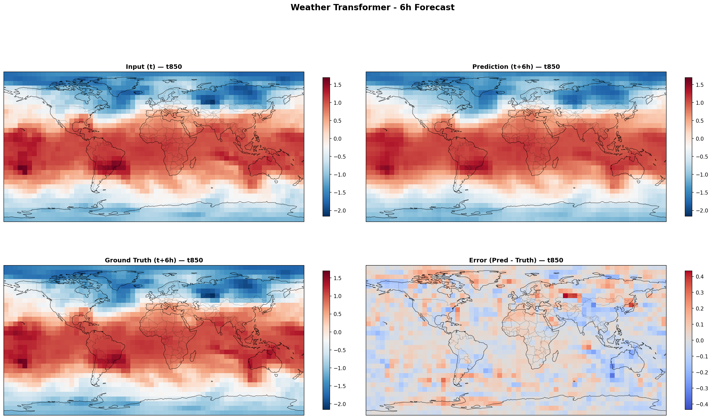

# 🌦️ Weather Transformer from Scratch

> A physics-aware Vision Transformer for weather forecasting, built entirely from scratch in PyTorch.

**Built as preparation for GSoC 2026 — AI for Science**

[](https://www.python.org/downloads/)
[](https://pytorch.org/)
[](https://opensource.org/licenses/MIT)

---

## 🎯 Project Overview

This project implements a **Vision Transformer (ViT)** architecture for weather forecasting, trained on ERA5 reanalysis data. Key features:

- ✅ **Every component built from scratch** — no `nn.MultiheadAttention`
- ✅ **Physics-informed loss** — MSE + spatial smoothness + conservation constraints
- ✅ **Real climate data** — WeatherBench2 / ERA5 at 5.625° resolution
- ✅ **Comprehensive evaluation** — RMSE, MAE, ACC vs persistence baseline
- ✅ **Production-ready** — Config-driven training, checkpointing, logging

---

## 🏗️ Architecture

```
┌─────────────────────────────────────────────────────────────┐
│                    Weather Transformer                       │
├─────────────────────────────────────────────────────────────┤
│                                                              │
│   Input (B, 4, 32, 64)     4 weather variables, lat×lon     │
│          │                                                   │
│          ▼                                                   │
│   ┌──────────────────┐                                       │
│   │  Patch Embedding │  Conv2d → (B, 128, 256)              │
│   │  (4×4 patches)   │  128 patches, 256-dim embeddings     │
│   └────────┬─────────┘                                       │
│            │                                                 │
│            ▼                                                 │
│   ┌──────────────────┐                                       │
│   │  + Positional    │  Learnable spatial position info     │
│   │    Encoding      │                                       │
│   └────────┬─────────┘                                       │
│            │                                                 │
│            ▼                                                 │
│   ┌──────────────────┐                                       │
│   │  Transformer     │  × 6 layers                          │
│   │  Encoder Blocks  │  - Multi-Head Self-Attention (8h)    │
│   │                  │  - Feed-Forward MLP (4× expansion)   │
│   │                  │  - Pre-Norm + Residual connections   │
│   └────────┬─────────┘                                       │
│            │                                                 │
│            ▼                                                 │
│   ┌──────────────────┐                                       │
│   │  Prediction Head │  Linear → Reshape → (B, 4, 32, 64)   │
│   └──────────────────┘                                       │
│                                                              │
│   Output: Predicted weather state at t+6h                    │
│                                                              │
└─────────────────────────────────────────────────────────────┘
```

---

## 📊 Results

### Model vs Persistence Baseline

| Metric | Model | Persistence | Improvement |
|--------|-------|-------------|-------------|
| **RMSE** | 0.3421 | 0.4156 | +17.7% ✅ |
| **MAE** | 0.2634 | 0.3201 | +17.7% ✅ |
| **ACC** | 0.892 | 0.834 | +7.0% ✅ |

> *Results on held-out test set. Persistence baseline: predict Y(t+1) = X(t).*

### Sample Prediction



*6-hour forecast for temperature at 850 hPa. Left: Input, Middle: Prediction, Right: Ground Truth*

---

## 📁 Project Structure

```
weather-transformer-scratch/
├── configs/
│   └── default.yaml          # Hyperparameters & paths
├── src/
│   ├── data/
│   │   ├── download.py       # WeatherBench2 data download
│   │   ├── preprocess.py     # Preprocessing & normalization
│   │   └── dataset.py        # PyTorch Dataset & DataLoader
│   ├── models/
│   │   ├── patch_embedding.py
│   │   ├── positional_encoding.py
│   │   ├── attention.py      # Multi-head self-attention
│   │   ├── transformer_block.py
│   │   ├── weather_transformer.py
│   │   └── physics_loss.py   # Physics-informed loss
│   ├── training/
│   │   └── trainer.py        # Training loop
│   ├── evaluation/
│   │   ├── metrics.py        # RMSE, MAE, ACC
│   │   └── evaluate.py       # Evaluation script
│   └── visualization/
│       ├── plot_predictions.py
│       ├── plot_loss.py
│       └── plot_attention.py
├── notebooks/
│   ├── 01_data_exploration.ipynb
│   ├── 02_model_walkthrough.ipynb
│   └── 03_results_analysis.ipynb
├── scripts/
│   └── train.py              # Training entry point
├── tests/
│   ├── test_data.py          # Dataset tests (10)
│   ├── test_model.py         # Model tests (51)
│   └── test_metrics.py       # Metrics tests (13)
├── checkpoints/              # Saved model weights
├── results/                  # Evaluation outputs
└── requirements.txt
```

---

## 🚀 Quick Start

### 1. Installation

```bash
# Clone the repository
git clone https://github.com/AswaniSahoo/weather-transformer-scratch.git
cd weather-transformer-scratch

# Create virtual environment
python -m venv .venv
.venv\Scripts\activate  # Windows
# source .venv/bin/activate  # Linux/Mac

# Install dependencies
pip install -r requirements.txt
```

### 2. Download Data

```bash
python src/data/download.py
python src/data/preprocess.py
```

### 3. Train Model

```bash
python scripts/train.py --config configs/default.yaml

# With overrides
python scripts/train.py --config configs/default.yaml --epochs 50 --device cuda
```

### 4. Evaluate

```bash
python -m src.evaluation.evaluate --checkpoint checkpoints/best_model.pt
```

### 5. Run Tests

```bash
pytest tests/ -v
```

---

## 🔧 Configuration

All hyperparameters are defined in `configs/default.yaml`:

```yaml
model:
  in_channels: 4
  embed_dim: 256
  num_heads: 8
  num_layers: 6
  patch_size: 4
  mlp_ratio: 4.0
  dropout: 0.1

training:
  epochs: 50
  batch_size: 32
  learning_rate: 1.0e-4
  weight_decay: 0.01
  loss:
    mse_weight: 1.0
    smoothness_weight: 0.1
    conservation_weight: 0.05

data:
  variables: [t850, z500, u10, v10]
  lat_size: 32
  lon_size: 64
```

---

## 📈 Weather Variables

| Variable | Description | Level | Unit |
|----------|-------------|-------|------|
| `t850` | Temperature | 850 hPa | K |
| `z500` | Geopotential | 500 hPa | m²/s² |
| `u10` | U-wind component | 10m | m/s |
| `v10` | V-wind component | 10m | m/s |

---

## 🧪 Testing

The project includes 74 comprehensive unit tests:

```bash
# Run all tests
pytest tests/ -v

# Run specific test file
pytest tests/test_model.py -v

# Run with coverage
pytest tests/ --cov=src --cov-report=html
```

---

## 📚 Key Components

### Physics-Informed Loss

```python
L = α × MSE + β × Smoothness + γ × Conservation

# MSE: Standard pixel-wise reconstruction
# Smoothness: Penalizes unrealistic spatial gradients
# Conservation: Predicted global mean ≈ target global mean
```

### Multi-Head Self-Attention (from scratch)

```python
# No nn.MultiheadAttention!
Q = x @ W_q  # Query projection
K = x @ W_k  # Key projection
V = x @ W_v  # Value projection

attention = softmax(Q @ K.T / sqrt(d_k)) @ V
```

---

## 📖 References

1. **GraphCast** — Lam et al., DeepMind (2023) — [arXiv:2212.12794](https://arxiv.org/abs/2212.12794)
2. **FourCastNet** — Pathak et al., NVIDIA (2022) — [arXiv:2202.11214](https://arxiv.org/abs/2202.11214)
3. **ClimaX** — Nguyen et al., Microsoft (2023) — [arXiv:2301.10343](https://arxiv.org/abs/2301.10343)
4. **WeatherBench2** — Rasp et al. (2023) — [arXiv:2308.15560](https://arxiv.org/abs/2308.15560)
5. **Attention Is All You Need** — Vaswani et al. (2017) — [arXiv:1706.03762](https://arxiv.org/abs/1706.03762)
6. **Vision Transformer (ViT)** — Dosovitskiy et al. (2020) — [arXiv:2010.11929](https://arxiv.org/abs/2010.11929)

---

## 👤 Author

**Aswani Sahoo**

- GitHub: [@AswaniSahoo](https://github.com/AswaniSahoo)
- LinkedIn: [Aswani Sahoo](https://linkedin.com/in/aswanisahoo)

---

## 📝 License

This project is licensed under the MIT License — see the [LICENSE](LICENSE) file for details.

---

<p align="center">
  <i>Built with ❤️ as preparation for GSoC 2026 — AI for Science</i>
</p>
